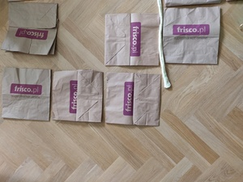
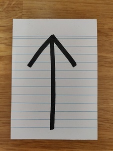
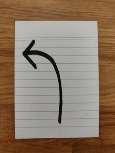
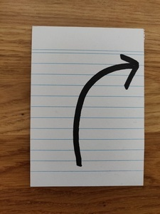
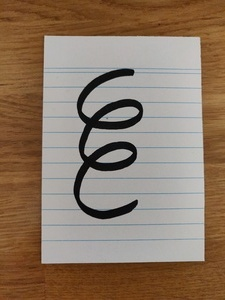

## Zabawa w robocika

### Przygotowanie

Potrzebne są:

- trochę miejsca na podłodze
- coś do wyznaczania pól (jak w grze planszowej) - np. taśma malarska, kartony kwadratowe, duże puzzle piankowe podłogowe czy podobne
- zestaw instrukcji
- robocik
- i jego programista

Plansza / tor:

- wyznacz tor na podłodze złożony z kilku pól, np:

### Robocik

Każdy, kto chce się bawić

### Zestaw instrukcji

Zrób krok do przodu

Obróć się w miejscu w lewo

Obróć się w miejscu w prawo

Skocz do przodu o jedno pole

### Zabawa / Zadanie

Programista:
- ogląda tor i kompletuje plik instrukcji (Uwaga! Ważna jest ich kolejność)
- podaje robotowi

Dla robota:
- staje na początkowym polu toru
- i wykonuje po kolei instrukcje jedna po drugiej

Można teraz skomplikować tor i sprobować napisać nowy program.

### Jak to się ma do pracy programisty?

Plik instrukcji to program komputerowy. Napisany/skonstruowany przez
programistę. Samo oglądanie programu komputerowego rzadko kiedy pozwala
przewidzieć, jaki będzie efekt końcowy. I z drugiej strony patrząc - jeśli
ktoś określi nam efekt końcowy, nie jest łatwo wymyślić program, który ten cel osiągnie.

Dopiero jego wykonanie - tj. wykonanie po kolei każdej instrukcji od
początku do końca pozwala programiście poznać efekt końcowy.

W prawdziwych programach komputerowych instrukcje są inne - zamiast kroków i obrotów
instrukcje dotyczą przetwarzania danych - zapisywania, wysyłania lub
odbierania, czy pokazywania na ekranie, itp.

---- 

This work is licensed under a [Creative Commons Attribution-ShareAlike 4.0 International License](http://creativecommons.org/licenses/by-sa/4.0/)
